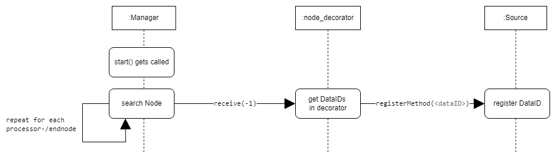

# Architecture

## Targets

The primary goals of the framework are:

- a unified project structure
- multithreading security
- compatibility
- Ensuring customizability

&nbsp;

## Objects and Classes

## Basic datastream

## Standard call sequences

### Registration

### Pipeline call

